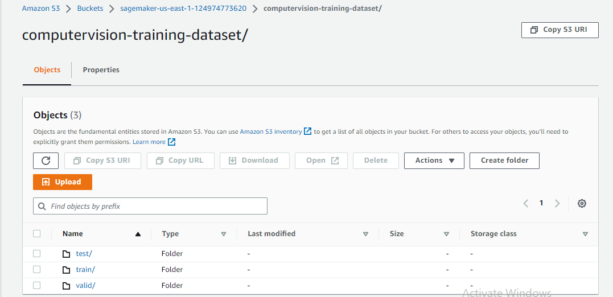
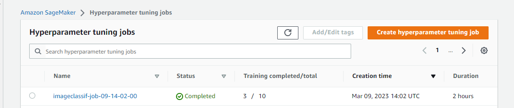
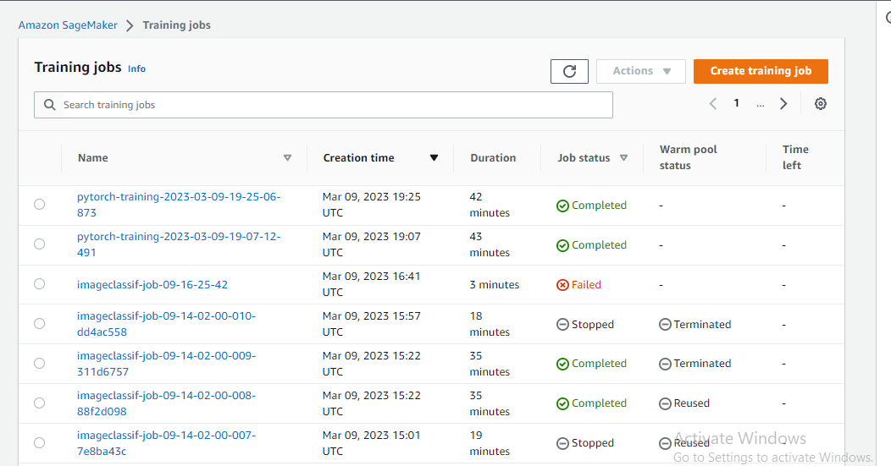
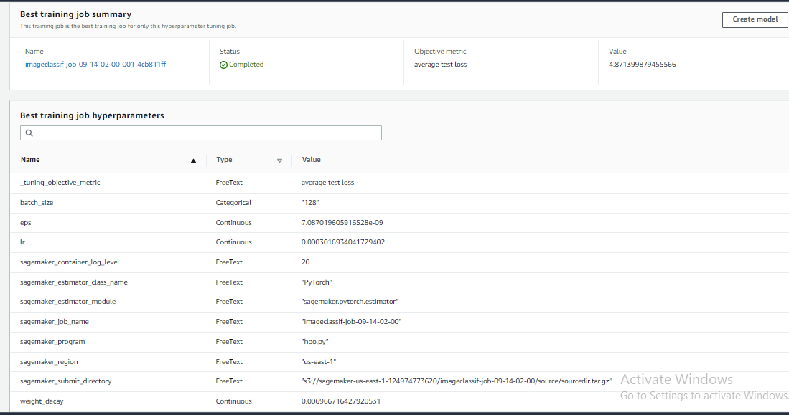
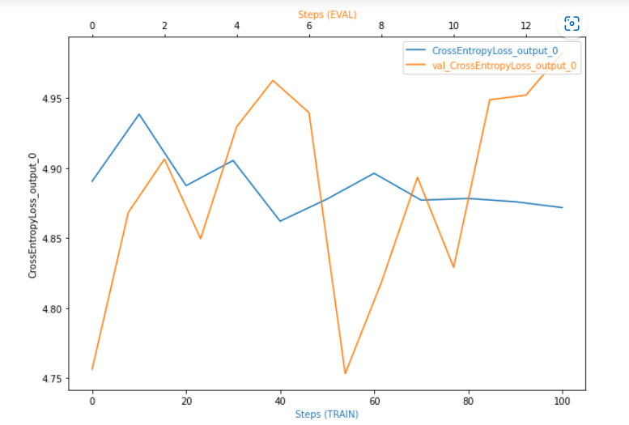
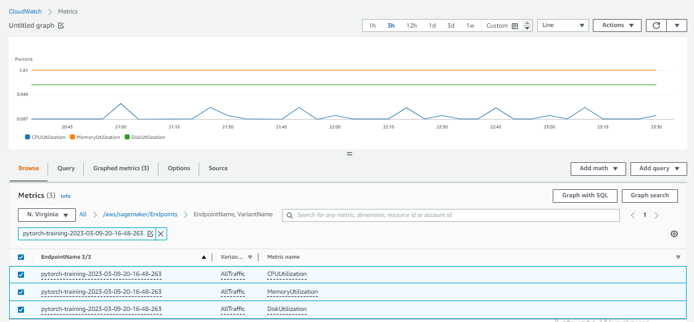
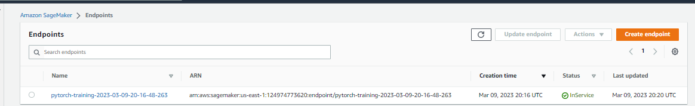

# Image Classification using AWS SageMaker

Use AWS Sagemaker to train a pretrained model that can perform image classification by using the Sagemaker profiling, debugger, hyperparameter tuning and other good ML engineering practices. This can be done on either the provided dog breed classication data set or one of your choice.

## Project Set Up and Installation
Enter AWS through the gateway in the course and open SageMaker Studio. 
Download the starter files.
Download/Make the dataset available. 

## Dataset
The provided dataset is the dogbreed classification dataset which can be found in the classroom.
The project is designed to be dataset independent so if there is a dataset that is more interesting or relevant to your work, you are welcome to use it to complete the project.

### Access
Upload the data to an S3 bucket through the AWS Gateway so that SageMaker has access to the data. 

## Hyperparameter Tuning
What kind of model did you choose for this experiment and why? Give an overview of the types of parameters and their ranges used for the hyperparameter search

## Project Overview 
### this project consists of the following files:
- hpo.py : contains code that will be used by the hyperparameter tuning jobs 
- train_model.py : contains the code that will be used by the training job 
- endpoint_inference.py: contains code that is used by the deployed endpoint
- train_and_deploy.ipynb : contains all the code and steps performed in this project
### model:
used a pretrained Resnet50 model from pytorch. and added a two Fully connected NN Layers on top model to adjust the output to the case in hand.
## Hyperparameter Tuning
ResNet50 model with a two Fully connected Linear NN layer's is used for this image classification problem
### Hyperparameter Tuning Job
The optimizer that we will be using for this model is AdamW.
hyperparameters selected for tuning were:
- Learning rate - default is 0.001 , selected range (0.01 to 100) 
- eps - default is 1e-08 , selected  range (1e-09 to 1e-08)
- Weight decay - default is 0.01 , selected range (0.1 to 10) 
- Batch size -- selected  two values [ 64, 128 ]

### Training Job

### Best hyperparameter Training Job

## Debugging and Profiling
set the Debugger hook to record and keep track of the Loss Criterion metrics of the process in all phases (training/ validation/ testing) and set the Profiling hook track the memory utilization and GPU utilization
Cross entropy plot is shown below

Suggested fixes?
- retrain some of the top layers in the pretrained model 
- adding more fully connected layers and observe the behaviour. 
- add more dropout and normalization layers
- 
### Results

Result looks good, as we had utilized the GPU while hyperparameter tuning and training of the fine-tuned ResNet50 model.
We used the "ml.m5.xlarge" instance type for the runing the traiing purposes. However while deploying the model to an endpoint we used the "ml.t2.medium" instance type.

## Model Deployment
- deployed to a "ml.t2.medium" instance type and we used the "endpoint_inference.py" script to setup and deploy our working endpoint.
- using some test images to test the model against
- used two approaches:
   - Prdictor 
   - boto3 client

